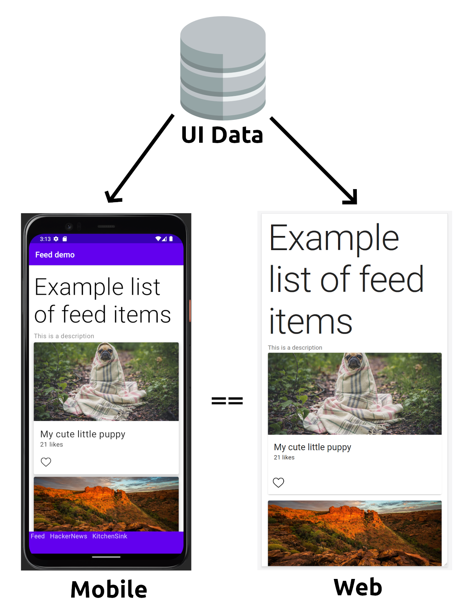

# Server Driven User Interface (SDUI)

**Currently this is a work in progress. Expect things to not work and change.**

[Read documentation here](docs/README.md)

## Overview

Server Driven User Interface (SDUI) is a new design paradigm that's being used by companies like [AirBnB](https://medium.com/airbnb-engineering/a-deep-dive-into-airbnbs-server-driven-ui-system-842244c5f5), [Expedia](https://www.apollographql.com/customers/expediagroup/), and [Lyft](https://lyftmobilepodcast.libsyn.com/server-driven-ui-with-kevin-fang-jeff-hurray). [_sources are linked_]

**The main advantage of SDUI is that *ALL* business logic is kept within the server-side, and the client-side (frontend) should remain *'dumb'* to only serve UI.**

This design paradigm/architecture allows you to ship features faster to your users. It's advantage is directed more towards mobile applications (Android & iOS) by leveraging prebuilt components within the app that are then composed by the server to build out new experiences to your users without having them update their app.

Observing the diagram above, all clients (android, iOS, and Web - react) are all looking towards the template service to provide a response for the view. The template service will call the compositor which holds the schemas to build out the components. All clients are bound to build these components based of that schema for it to be coupled to the response.

## About this project

This project is to be used a resource and a playground to learn SDUI. It covers an end to end implementation on how SDUI works.

It's primary focus is to follow the SDUI paradigm by ensuring the clients reference the same data endpoint that provides the UI schematics on how it should render.

Below shows the output from the mobile Android view and the web view from this project.

The repository is broken up into different modules:

**graphql-server**

This module is the compositor, and is the place where you will define your schemas. When you want to define UI modules, components, pages this is the place. Since it also provides the response, updating your presentation data or changing the layout of your components, it is all done here.

**template-server**

The template server is used as an intermediary between the compositor layer and the client. It can make multiple calls to different queries within the GraphQL server to stitch together a screen/page layout. All clients are required to call the template server to build out the pages. The template server removes the need for clients to build large and complex GraphQL queries in favour of a REST response.

**tokens**

Tokens module is used to generate the style tokens that can be used across clients.

**web-app**

A react web app that showcases the SDUI design put together.

**android-app**

An Android jetpack compose app that showcases SDUI.

## Documentation

[Read documentation here](docs/README.md)