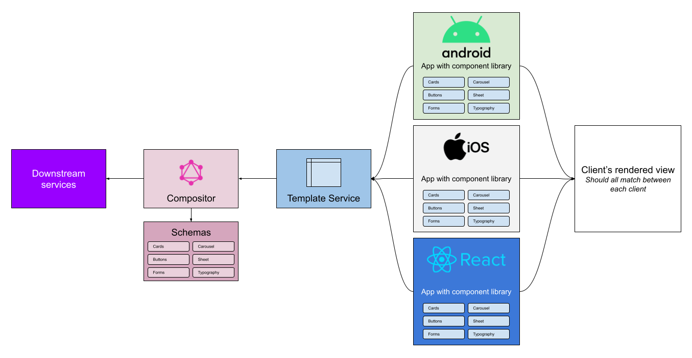

# Server Driven User Interface (SDUI)

**Currently this is a work in progress. Expect things to not work and change.**

## Overview

Server Driven User Interface (SDUI) is a new design paradigm that's being used by companies like [AirBnB](https://medium.com/airbnb-engineering/a-deep-dive-into-airbnbs-server-driven-ui-system-842244c5f5), [Expedia](https://www.apollographql.com/customers/expediagroup/), and [Lyft](https://lyftmobilepodcast.libsyn.com/server-driven-ui-with-kevin-fang-jeff-hurray). [_sources are linked_]

This design paradigm/architecture allows you to ship features faster to your users. It's advantage is directed more towards native applications (Android & iOS) by leveraging prebuilt components within the app that are then composed by the server to build out new experiences to your users without having them update their app.

Observing the diagram above, all the clients (android, iOS, and Web - react) are all looking towards the compositor to provide a response for the view. The compositor holds all the schemas to build out the components and the client's are each contracted to build components that can then be coupled.

## About this project

This project is to be a resource and a playground to learn SDUI. It covers the end to end excluding the downstream services, as it should be self explanatory on how that would work.

The repository is broken up into different modules:

**graphql-server**

This module is the view compositor and will dictate the view. Here you will create your schemas and responses. If you want to update typography, change the layout, build out your component definition, it should be done here.

**generated-types**

Generated types module is to house all graphql queries, mutations, and fragments. It's the one stop shop for all clients to reference. This is to prevent duplicating the queries across clients and to maintain consistency.

**tokens**

Tokens module is used to generate the style tokens that can be used across clients.

**web-app**

A react web app that showcases the SDUI design put together.

**android-app**

An Android jetpack compose app that showcases SDUI.

## Guiding Principle

> The server should always dictate the presentation, but should never control the design.