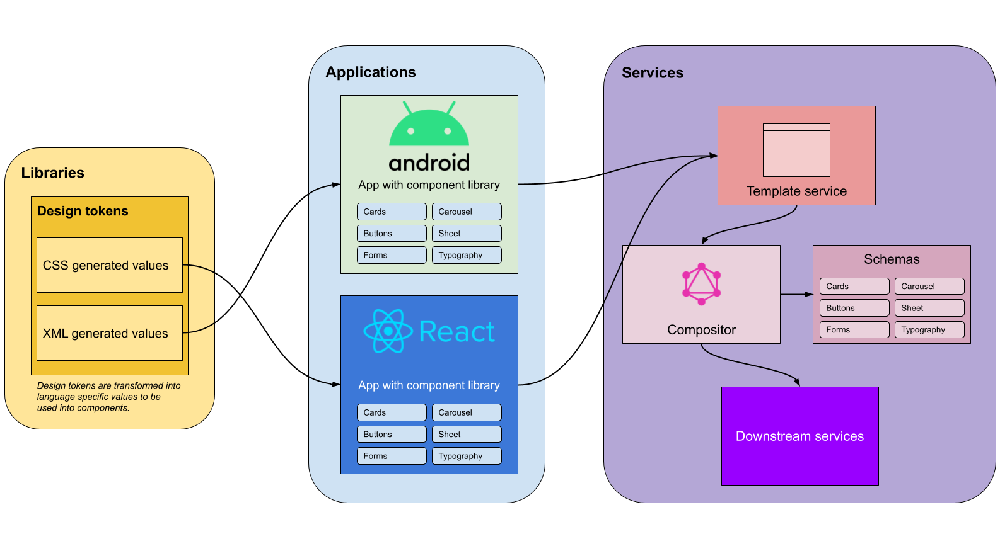

# Architecture fundamentals

The core principle of this project and in SDUI is to only write once; DRY (don't repeat yourself).

Overview diagram illustrating libraries, applications, and services that stitches it all together to make this SDUI.

## Style tokens

This is out of the scope of SDUI but is good practice to provide consistency across multiple applications.

When working with multiple clients (Android, iOS, Web) it is important for all clients to share the same styling in order to provide a unified visual experience to your users. This can be achieved through the use of style tokens.

The [tokens module](../tokens) demonstrates how to create design tokens that can export to multiple clients.

Design tokens allows you to be able to update your visual design values and have it distributed to your different platforms. Each client will have it's own specific language, for example, web requires CSS, whereas Android will want XML resources. Rather than cross-checking across platforms whether or not the values are consistent, keep the tokens and generation of the specific language in one location.

## Application

Android, iOS, and Web applications **should not contain any business logic**. Any business logic, if any, should not be done to the user interface (UI). UI should be dumb and any response given from the server-side must  be the resolved value. This is an important and key role to SDUI. **Having any business logic within the UI defeats the purpose of SDUI, as you are now letting the client determine the view rather than the server.**

## Template service

The template service is the client's one stop shop for building the views. The client can provide some context to the template service for it to tailor specific responses for that domain. This also removes individual clients from having to write their own GraphQL. Rather, all queries can be kept within the template service and let it handle how the presentation should look like. The template service can make 1 or many query calls to build a page and return it as a response for the client to digest. Depending on preference, it can be REST, WebSockets or an alternative - depends on the use case.

## Compositor (GraphQL Server)

The compositor is the service that composes the view elements for a module or page that the template service requests for. This service should determine the presentation, such as, the components layout and the order of components. It should also populate components values using the downstream services. The compositor should not contain any styling values, such as, font size, color, spacing, etc. Components are pre-built within the client and should always fulfill the requirements of the designs. **If you were to allow style values within the compositor you are then allowing developers to be able to provide custom values that goes against a design contract. It also confuses the role of responsibility of where the styles should come from, and will also make it hard to find where the root cause is when there is an issue with the visual style.**