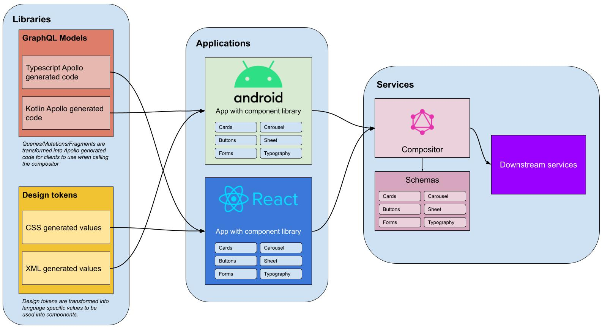

# Architecture fundamentals

The core principle of this project and in SDUI is to only write once; DRY (don't repeat yourself).

Overview diagram illustrating libraries, applications, and services that stitches it all together to make this SDUI.

## GraphQL models (queries, mutations & fragments)

It's important to home all client queries, mutations, and fragments in one place. It's easy for clients to have their own place where developers will write their graphql queries. The issue with this, is that all clients will have to update their fragments and queries rather than doing it in one place for all. It may also lead to inconsistencies and issues where a particular client might be missing a field that will result on missing information that could be important to your user.

Other inconsistencies may include how the fragments may be written. It will lead into having each client having conversations with each other to resolve the same issue. It will reduce unwanted time figuring out how each client has worked on building the fragments when all of these graphql files are kept in one place.

## Style tokens

This is out of the scope of SDUI but is good practice for organizations or if you're wanting to provide consistency across your applications.

When working with multiple clients (Android, iOS, Web) it is important for all clients to share the same styling in order to provide a unified visual experience to your users. This can be achieved through the use of style tokens.

The [tokens module](../tokens) demonstrates how to create design tokens that can export to multiple clients.

Design tokens allows you to be able to update your visual design values and have it distributed to your different platforms. Each client will have it's own specific language, for example, web requires CSS, whereas Android will want XML resources. Rather than cross-checking across platforms whether or not the values are consistent, keep the tokens and generation of the specific language in one location.

## Application

Android, iOS, and Web applications **should** not contain any business logic. Any business logic, if any, should not be done to the user interface (UI). UI should be dumb and any response given from the server-side must be handled. This is an important and key role to SDUI. **Having any business logic within the UI defeats the purpose of SDUI, as you are now letting the client determine the view rather than the server.**

## Compositor (GraphQL Server)

The compositor is the service that composes the view for the client. It should determine the layout, such as, order of components. It will provide the values for the components to render as well as what components to render. The compositor should not contain any styling values, such as, font size, color, spacing, etc. Components are pre-built within the client and should always fulfill the requirements of the designs. **If you were to allow style values within the compositor you are then allowing developers to be able to provide custom values that goes against a design contract. It also confuses the role of responsibility of where the styles should come from, and will also make it hard to find where the root cause is when there is an issue with the visual style.