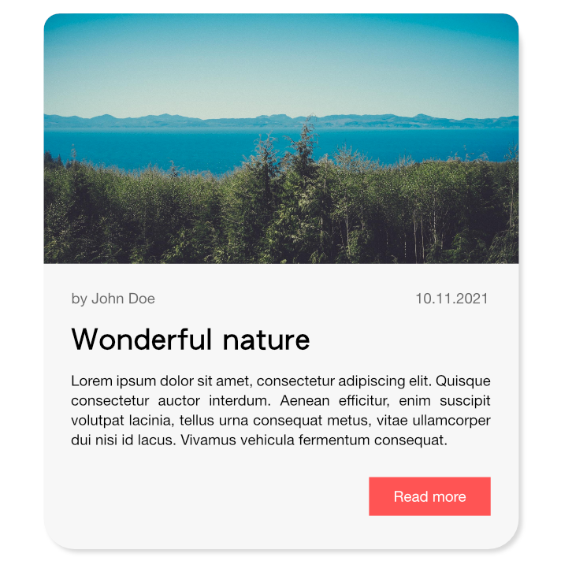
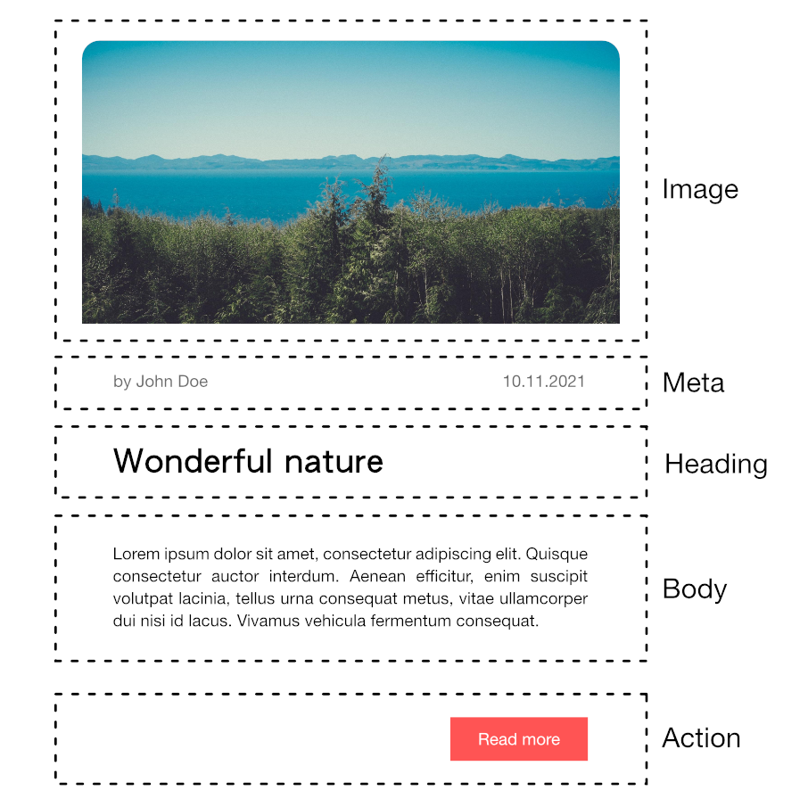
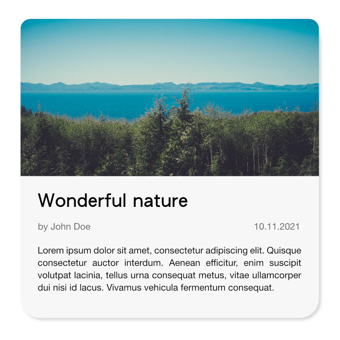
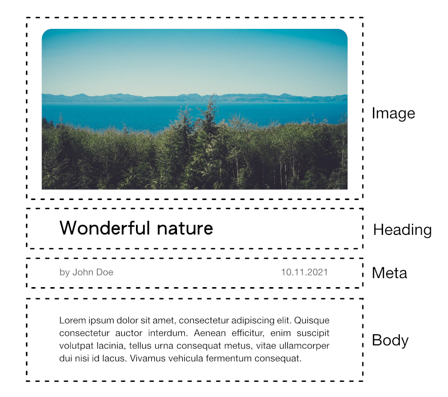

# Writing schema for clients

This document is a guideline when it comes to writing up a schema for your client applications.

## Design first

Before you can start writing a schema it is best to first have a design of a component first that will be used as reference. Schemas can be quickly become annoying to change once it has been deployed to an environment, and is preferred to be well thought out before it gets released to an environment. However, I don't mean that it requires to be feature complete, it can also be worked on iteratively, but should not change existing fields within the schema design.

## Atomic design

Brad Frost's [Atomic Design](https://atomicdesign.bradfrost.com/table-of-contents/) is an amazing book and online resource that helps you dissect designs. Frost takes the scientific idea of breaking down chemical reactions such as organisms, molecules and atoms and how this idea can be applied to visual designs. He best explains it [chapter two](https://atomicdesign.bradfrost.com/chapter-2/) and highly suggest reading it.

To give a TLDR;

**Atoms** - these are foundational building blocks that make up our user interfaces. These can be identified as labels, inputs, buttons, text, they cannot be broken down any further without ceasing to be functional.

**Molecules** - they are relatively simple groups of UI. They comprise of atoms put together to become a unit. For example, a label, input field and button put together create a form molecule.

**Organisms** - are complex UI components that are composed of molecules and atoms that build a distinct section of an interface. An example would be a header of a web page which would embed a navigation bar (molecule), a logo (atom), a search form (molecule).

**templates** - are page-level objects that place organisms accordingly. Templates can be reused across pages.

**pages** - these are specific instances of the template.


## Design breakdown

Let's take a look at an example of a card component which we will take reference from when designing a schema.



We can see this card component may be used to display blog posts, recipes, news, etc. It may have multiple usages and traditionally these components are designed for a specific usage.

From our understanding of Atomic Design we can identify that this component is a molecule because it's a relatively simple group of UI elements. It contains a bunch of atoms that when put together it becomes a card.



Looking at the breakdown shown above we can see each element separated to it's on concern. With this we are now ready to start building our schema.

## Building the schema

When building a schema using old habits of your traditional client driven approach, it may look like this:

```graphql
type NewsCard {
  image: Image
  author: String
  postDate: String
  heading: String
  body: [String]
  button: ButtonAction
}

type ButtonAction {
  text: String
  url: String
}

type Image {
  url: String
  description: String
}
```

What's wrong with this approach is that it is not composable. You've now heavily coupled the schema to the design without allowing for flexibility. This is not an issue if a component will not change it's design or you have no requirement for experimentation. This is why it is important for designs to be well thought out as it will help schemas be built a lot faster. Let's take a look at a possible scenario with the card that as an alternative use.



Looking at the above we can see that the action button is no longer present and now the meta is below the heading whereas before it was above. You can argue that you can see use the same graphQL schema, but it would mean that the client will now have to have a new component or added business logic into the component for it to look like the design above. This would mean that for native clients (Android, iOS) you'll have to release a new version with this update to your users and it won't be for some time that most your users will have this version of the app. This goes for the same when creating A/B tests and experiments. Your experiments will have to go over a longer period of time because you're having to add in more work and time for it to be used by your users.

Let's take a look at the breakdown one last time.



To make the card become composable, we'll need have all elements be contains in a list of possible types that may be returned.

```graphql
type NewsCard {
  elements: [NewsCardElement]
}

type Button {
  text: String
  url: String
}

type Image {
  url: String
  description: String
}

type NewsCardMeta {
  author: String
  publishDate: String
}

interface Typography {
  text: String
}

type Heading implements Typography {
  text: String
}

type Paragraph implements Typography {
  text: String
}

type Paragraphs {
  paragraph: [Paragraph!]
}

union NewsCardElement = Button | Image | NewsCardMeta | Heading | Paragraphs
```

When breaking up each atom from the design we can then have a list of elements that may get rendered in any order. This schema provides us with a lot of flexibility. We can now make updates on how we want to order our elements on the server and the client will get the updates without users having to update.