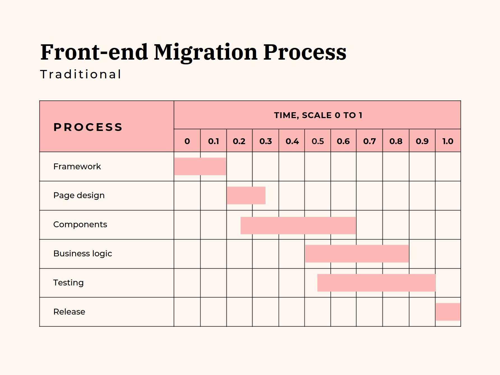
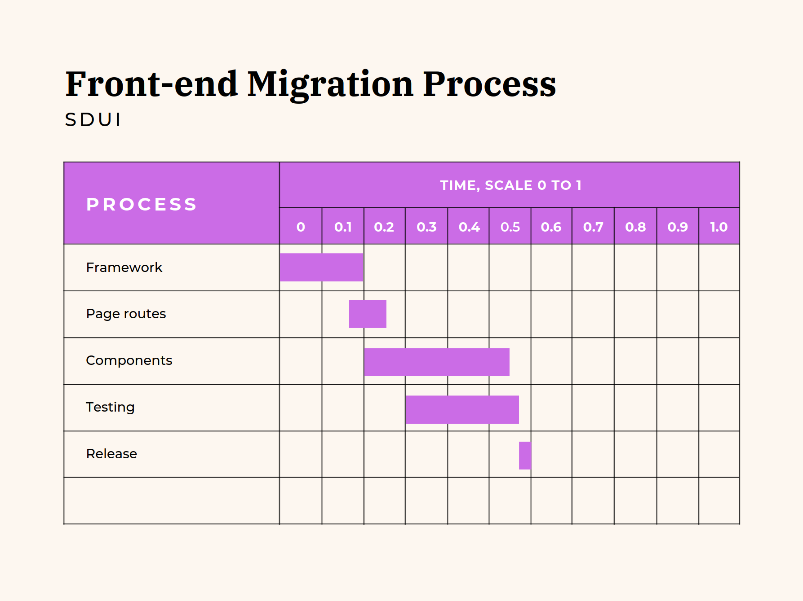

# All business logic should only live in the server-side

There are great benefits to having business logic derived from the server-side.

These benefits include:

- Front-end clients can be slim and be solely focused on user-interface (UI).
- Future migrations to different technology stacks/platforms within the front end require less effort.
- Separation of concerns are more clearly defined.
- Front end unit tests are less focused on meeting business logic requirements and more on providing correct visuals.
- Multiple clients will all share same conditions and be in parity.
- Experiments/features are controlled from the one source
- Localization is primarily done via the server-side.

Server-driven UI (SDUI) unleashes all of the above by default. As to be completely SDUI, the response from the server should only provide values that shape the UI, and not values to be massaged into the UI.

Typically, we see a lot of front end clients get REST or GraphQL responses that return data values to be placed within the UI. This can be pricing data, customer data, shopping item data, etc. With this data, there are often times where manipulation must be made for certain cases. This can be, calculating values for a total price within in a shopping cart. Or, displaying customer data in some bespoke presentation depending on their tier. Or, displaying certain shopping items due to business filters, etc.

```diff
{
  // Traditional
-  "customerDetails": {
-    "name": "John Smith",
-    "age": 35,
-    "address": "123 Fake street, New York City"
-  }
  // SDUI
+  "elements": [
+    {
+      "__typename": "Typography",
+      "text": "John Smith",
+      "typographyVariant": "BODY1",
+      "typographyTheme": "PRIMARY"
+    },
+    {
+      "__typename": "Typography",
+      "text": "Age: 35"
+      "typographyVariant": "BODY1",
+      "typographyTheme": "PRIMARY"
+    },
+    {
+      "__typename": "Typography",
+      "text": "Address: 123 Fake street, New York City"
+      "typographyVariant": "BODY1",
+      "typographyTheme": "PRIMARY"
+    },
+  ]
}
```
_A rough example showcasing the differences between 'traditional' data vs SDUI. 'Traditional' provides just values whereas SDUI provides a design schema_

The problems will become apparent once the business or technology changes. Examples are when a business moves towards building a platform, or a new front-end framework is taking trend with major benefits. Migrating these front end client apps require a lot of effort, especially if there's a lot of hidden business logic held within it. Migrations will need to be done in small iteration and done for certain majority cases. The time to release is long and heavily monitored to ensure disruption is minimal and business value is also gained. Cost of this work is often high and usually will involve impacting disruption due to leadership changes and company reorganization (in large companies).

It is simpler to leverage a data schematic providing the whole shape of the UI - this is what SDUI offers. Moving to different UI frameworks is primarily focused on the framework gains. Developers can work on performance improvements and focus on innovation. Less concerns are made to negative business impact to changes. This is a major win!

What I'm outlining here brings major wins for the front end. Back end migrations and changes will still fall under the same traditions we do today, and heavy testing will be used to ensure confidence is made with the changes.

## Front end migrations

Let's dive a little deeper into migrations, and see the processes broken down into figurative timelines. Take a look at the 2 images below.

**Disclaimer:** _Please beware that this isn't fact and is based on assumed prior experience knowledge._





It is often business logic and components that create a lot of complexity within the front end. It involves a lot of massaging of data values across different components and handling different business edge case views. Confidence is then done through testing; unit, integration and visual regression tests. We can see this in the 'Traditional' gantt chart.

Comparing to SDUI, the time is halved. Components are simpler. Tests are smaller. There's also no business logic. Because all business logic lives within the server-side the front end is more "pure" in that it's primary focus is now on UI.

However, I must stress that the server-side has to be feature complete in SDUI, only then is the migration simple and quick. Platform migrations would involve a lot more effort and education across multiple teams. This is an expensive task, but once complete, massive wins are gained like migrating front-end app to different frameworks.

## Experiments / Features

Being fully server driven unleashes some major feature releasing benefits. Since multiple clients are referencing the same source, the experimental features or A/B testing can be controlled from a single place. No longer would you have to create feature gates for each client, it can be controlled from one place.

Consistency is in peak interest. Consumers want the same experience between client platforms, and businesses want the same. We all want the days to be gone where another client platform like Android or Apple (iOS) differs from each other and one platform feels more superior than the other. Experiences should be shared. Therefore, I lack conviction when someone argues that each should have it's own feature gate. This is where inconsistencies begin to shine. Releases or experimentation of a feature should be rolled out at the same time. When something goes wrong, it should be turned off for all, not for one. The reason; consistency.

For mobile applications, SDUI allows for experiments to be toggled without new version releases. Since the UI and experiments are being composed from the server, freedom from versioning is gained.

## Localization

Front-end clients need to be resource careful. It is easy to blow out the bundle size for web apps to download, and also increase mobile application size. Large applications that distributes to multiple locales and embed localization files that are large in size. Caching is heavily used to help minimize performance impact, and monitoring the bundles with size limits are also used to help gate possible performance impacts. What's better is to shelf it to the server. Your localization team will also thank you.

SDUI composes strings that are readable to your users, so all the localization is done within the server-side. Fixing localization issues will also be easier because it's from one source and not multiple. Localization teams will have leave repeated work and reduce the number of possible mistakes.

However, client-side errors such as a failed network call will still require localization strings that are kept within the client and cannot be served by the server.

## Summary

Being completely server-driven by moving all the business logic to the server-side, keeps the client UI focused. The UI should be dumb and not smart. This does strip a lot of the developer "joys"/"fun" for front-end engineers, but to be a good engineer you have to apply principles to design and build to scale. Manipulating data and providing logic to the UI doesn't scale nor does it apply good principles to design. It leaves a tangled mess that requires more cognitive load and provides a solution that doesn't last as the system matures. Moving to this direction will remove the "hacky-ness" in places, and focus for front-end engineers will be more on creating better UI experiences and less wizardry data massaging to "make it work".