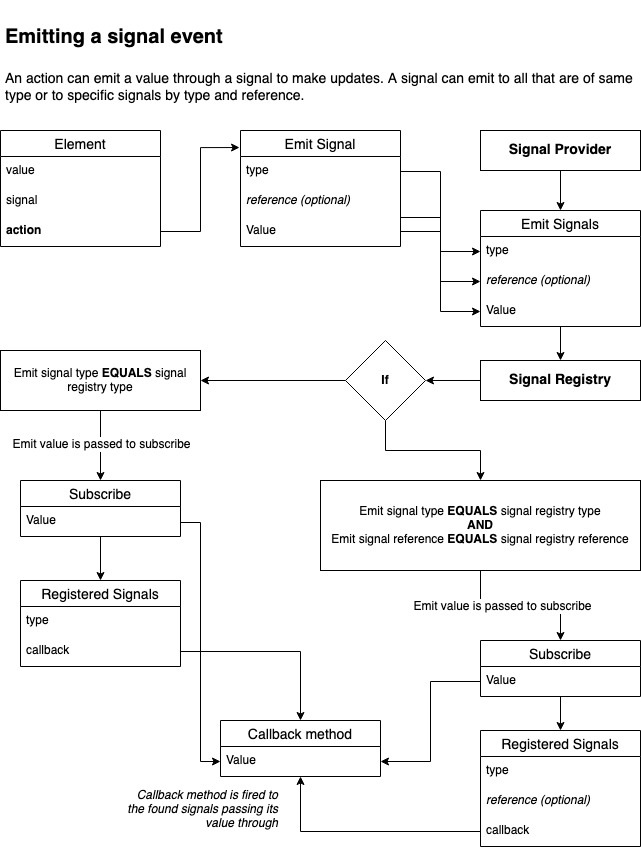

# Signals

Signals is another name of the [_observer_ pattern](https://refactoring.guru/design-patterns/observer). The idea allows you to subscribe to an event and it will listen if an event gets triggered. It makes it easy to create communication between different objects.

## What do signals do in SDUI?

To answer this question we need to understand the problems first.

### Problems when not using signals

All interactions that update the UI within the same view in SDUI have a graphQL mutation assigned to them. Working with actions that have mutations causes problems to quickly arise. Here's a quick list of problems that occur:

- Mutation response doesn't know how to place data appropriately
- Updating different parts of the page would require to force refresh the page to see changes
- Slow server speeds will cause UI to feel slow waiting on response

SDUI is easy to work with when building out static pages. The response creates the view with actions to lead you to the next view. When you want the current view with mutation updates it becomes a lot harder to work with and will quickly start adding complexity by introducing client specific logic to handle these events. That breaks the SDUI contract.

### Solution

You guessed it; Signals.

Signals allows you to render optimistic results from the original response without having to wait for the mutation result. The idea is for the server to provide a response that has an object that signal (observer) and an action that emits a new value.

Let's take a look at an example json response:

```json
{
  "data": {
    "item": {
      "signal": {
        "type": "GENERIC",
        "reference": null
      },
      "value": "My cool item"
    },
    "button": {
      "primary": "Click me!",
      "action": {
        "emitSignals": [
          {
            "type": "GENERIC",
            "reference": null,
            "value": "My cool item just got cooler!"
          }
        ]
      }
    }
  }
}
```

In the example there's an `item` and a `button`. The `item` has a signal within it for it to be registered and wait for an event to occur. We would assign a callback within registering the `item` signal to update it's value if a signal return.

The `button` has an action that will emit signals when triggered. The emitting signals array has one signal that has the same `type` as what's in `item`. When emitting the signal the value is being sent to all signals that are of the same type. `item` will receive the new value and be updated from `"My cool item"` to `"My cool item just got cooler!"`.

Hopefully, you can roughly understand it's awesome potential. The response can interact with itself! With the client being able to handle signals, the server can easy compose events that allows values to change depending on certain actions without having to wait for a mutation response. This is what we call 'optimistic rendering'.

The problems quoted before will now get eliminated.

> - ~~Mutation response doesn't know how to place data appropriately~~

Original response can place data in respective areas upon action.

> - ~~Updating different parts of the page would require to force refresh the page to see changes~~

Signals would update the UI without any refresh and be immediate.

> - ~~Slow server speeds will cause UI to feel slow waiting on response~~

Signals act immediately, the experience will not feel any impact from server response times.

### What it doesn't solve

Signals update the UI but doesn't change the response cache. So, if you have client side navigation you'll be rudely awakened to a response you originally had and not the modified one. However, this is solved with another trick.

[TODO: WRITE ARTICLE ON MUTATION CACHE UPDATING]

## A deeper dive

So you are now familiar with the basic idea of Signals and it's usage. Questions you may ask would possible be, 'what is `type`?' and 'what is `reference`?'.

Let's have a look the signal graphQL type:

```graphql
type Signal {
    type: SignalType!
    reference: String
}

enum SignalType {
    GENERIC
    FAVOURITE
    TITLE
}
```

So, we can see that `type` is using a enum type called `SignalType`. `SignalType` is used to identify what signal this relates to, it can help visualize the use case for signal to couple it with other object that have relationships with it. When a signal gets emitted it will always check it's registry to see if there's any signals that match it's type. This allows you to setup as many signals as you want with the same `type` to receive the same value. Let's take for example a shopping cart. Let's imagine a shopping cart link on the navigation bar that has a badge with the number of items within it, also on the same page you have a table displaying all the items within the cart and a number display the total of items. This value is the same on both the table and on the link badge. Let's now assign these items with a signal that's labeled with type; `CHECKOUT_SIZE`. When we remove an item we want this number to change, we can emit a signal event to change the value of the cart size and have this event sent to all signals that are of type `CHECKOUT_SIZE`. Now, we have updated the link badge and the table with one event and one call.

Great! Now we know how powerful signal types are, what's the purpose of `reference`? If you've ever programmed in C you'll be familiar with pointers. You would use your pointer to keep reference to memory. Similar to C, signal's case is using `reference` to identify which one of the signals it belongs to. Let's take a look at an example, let's say you have a feed of images and you can 'like' an image. If you 'like' an image a signal will be emitted to change it's state from 'un-liked' to 'liked', if all of these images are assigned with the signal `FAVOURITE` all of these images will now be 'liked' as the value is sent off to all signals that match the same type, uh-oh. This is where `reference` shine. You can assign a reference to the image when you are registering the signal, and when an action is fired you can refer to that reference with emitting so that the signal understands that it needs to travel to this particular type of signal that has a certain reference value. Now when you 'like' an image, only the image you've 'liked' will be 'liked' and not all images.

### Registering a signal

First thing to do when working with signals is to register one. When registering a signal it is important to provide a callback method as it will be used to subscribe to the event. Once created it will put the signal into a registry. This registry will be looked up when a signal get emitted and return any signals that match. When the found signals it will send an event to it's subscribers to let them know that the signal has been emitted.


### Emitting a signal

When you want your object that has a signal bound to it to have it's value updated, it done through emitting. Emitting a signal event is typically done through an action. The emitted signal will be sent through to the signal registry for lookup. Depending on certain conditions of the emitting signal, it can update the value of a single signal or to many signals. When it has found all the signals it needs to emit to it will trigger the callback methods that was provided when a signal is registered. The callback will handle what to do with the value it's given.



## Wrap up

Signals provide a solution to render optimistic results without depending on the server's response. This immerses the user to experience a fluid and responsive UI without being hindered heavily on server's feedback.

Signals can also work with the server's mutation response that can help emit it's results across multiple elements that have a signal registered. And forms of cross element/component communication can be done through the use of signals.