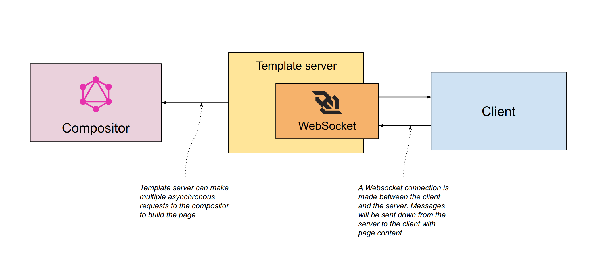

# Template Server



This server side application is used for clients to retrieve the page response via WebSockets. It is designed to remove a lot of the weight clients would have to make in favour of retrieving a single response. The template server may make multiple graphql requests asynchronously and send these responses as they arrive to the client via WebSockets. The socket will close once all internal requests are made and stitch into a single presentation.

### Benefits

The template server provide the following benefits:

- Single source of truth for the page response.
- Non-blocking page loading via WebSockets.
- Page composition can be handled within here.
- Simple interface for clients with smaller overhead as compared to GraphQL.
- GraphQL queries are kept and maintained in here for all clients.

### Getting started

To install:

```
npm ci
```

To run:

```
npm start
```

It will require graphql-server to be running for it to work.